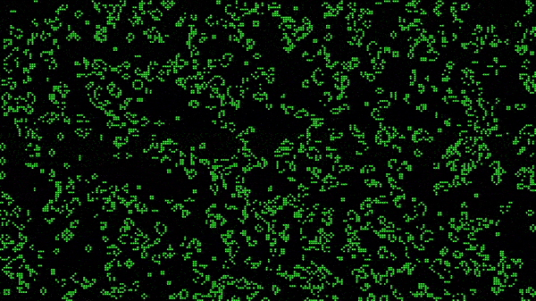

## Conway's Game of Life 

This is an implementation of Conway's Game of Life, a cellular automaton created by mathematician John Conway. This version is written in C++ and uses the SDL2 library for rendering.

### Requirements
C++11 or higher

SDL2 library

